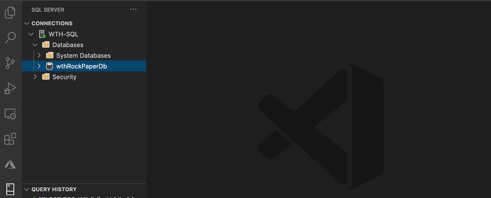
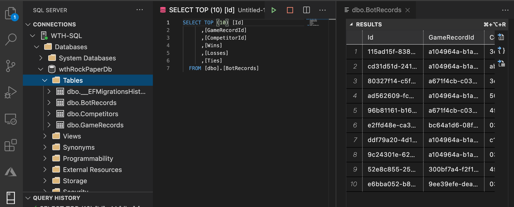

# Challenge 3 - Move to Azure SQL

## Provision Azure SQL

1. Prepare and define environment by defining easy to re-use variables in Azure CLI

    ```bash
    # Set the resource group name and location for your server
    resourceGroupName=WTH-RockPaper
    location=eastus

    # Random Identifier for deploying resources
    randomIdentifier=$RANDOM

    # Set an admin login and password for your database
    adminlogin=azureuser
    password=Azure1234567!

    # Set a server name that is unique to Azure DNS (<server_name>.database.windows.net)
    serverName=server-$randomIdentifier

    # Set the ip address range that can access your database
    startip=0.0.0.0
    endip=0.0.0.0
    ```

2. Create  a resource group for your resources with [az group create](https://docs.microsoft.com/cli/azure/group)

    ```bash
    az group create -n $resourceGroupName -l $location
    ```

3. Create Azure SQL Server with [az sql server create](https://docs.microsoft.com/cli/azure/sql/server)

    ```bash
    az sql server create \
        -n $serverName \
        -g $resourceGroupName \
        -l $location  \
        -u $adminlogin \
        -p $password
    ```

4. Configure Azure SQL Server firewall with [az sql server firewall-rule create](https://docs.microsoft.com/cli/azure/sql/server/firewall-rule)

    ```bash
    az sql server firewall-rule create \
        -g $resourceGroupName \
        -s $serverName \
        -n AllowYourIp \
        --start-ip-address $startip \
        --end-ip-address $endip
    ```

5. Create Azure SQL database with [az sql db create](https://docs.microsoft.com/cli/azure/sql/db)

    ```bash
    az sql db create \
        -g $resourceGroupName \
        -s $serverName \
        -n wthRockPaperDb \
        -e GeneralPurpose \
        --compute-model Serverless \
        -f Gen5 \
        -c 2 \
        --max-size 5GB
    ```

## Configure the application to use Azure SQL

1. Obtain Azure SQL connection string

    ```bash
    az sql db show-connection-string -s $serverName -n wthRockPaperDb -c ado.net
    ```

2. Update `docker-compose.yaml` to provide Azure SQL connection string

    ```yaml
    # Under rockpaperscissors-server service definition update Environment
    environment:
        "ConnectionStrings:DefaultConnection": "<Azure-SQL-ConnectionString>"
    ```

3. Run the application `docker-compose up`

## Validate the application is using Azure SQL

1. Connect to Azure SQL via your preferred SQL client


2. Query the database to observe records

